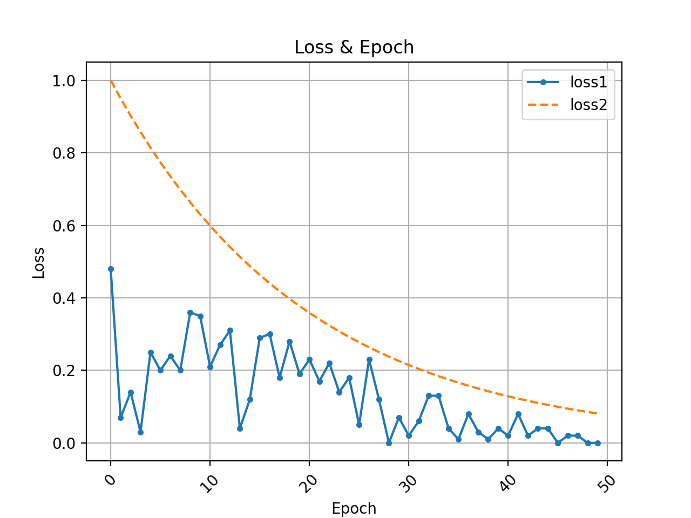

# Chart Toolkit for Technical Paper
## Motivation
为了在写作画图时更加方便和快捷，本工具包整合了常用制图代码以方便调用并快速出图。

## Color Palette 颜色版

## Line Chart
折线图常用标记点类型汇总 (Summary of flag points in line chart)

    ‘.’：点(point marker)
    ‘, ’：像素点(pixel marker)
    ‘o’：圆形(circle marker)
    ‘v’：朝下三角形(triangle_down marker)
    ‘ ^ ’：朝上三角形(triangle_up marker)
    ‘ < ’：朝左三角形(triangle_left marker)
    ‘ > ’：朝右三角形(triangle_right marker)
    ‘1’：(tri_down marker)
    ‘2’：(tri_up marker)
    ‘3’：(tri_left marker)
    ‘4’：(tri_right marker)
    ‘s’：正方形(square marker)
    ‘p’：五边星(pentagon marker)
    ‘ * ’：星型(star marker)
    ‘h’：1号六角形(hexagon1 marker)
    ‘H’：2号六角形(hexagon2 marker)
    ‘+’：+号标记(plus marker)
    ‘x’：x号标记(x marker)
    ‘D’：菱形(diamond marker)
    ‘d’：小型菱形(thin_diamond marker)
    ‘ | ’：垂直线形(vline marker)
    ‘_’：水平线形(hline marker) 

### Smooth Line Chart
```shell
python main.py --chart-mode=smooth_line_chart  
```
序列预测分数与真实值对比图
<div style="align: center">
<ul></ul>
</div>
loss对比图
<div style="align: center">
<ul></ul>
</div>

### Line Chart of Multiple Lines
```shell
python main.py --chart-mode=multi_line_chart
```
如下方第一列左一图所示，为了美观可以调整legend属性，将legend放置在图表外侧。
<div style="align: center">


</div>

## Bar Chart
### Single Bar Chart
```shell
python main.py --chart-mode=single_bar_chart  
```
<div style="align: center"></div>

### Grouped Bar Chart
```shell
python main.py --chart-mode=grouped_bar_chart  
```
可以根据自己的需求来调整画布尺寸(figsize)和柱状宽度(bar_width)以达到下图不同的效果。
<div style="align: center">


</div>
